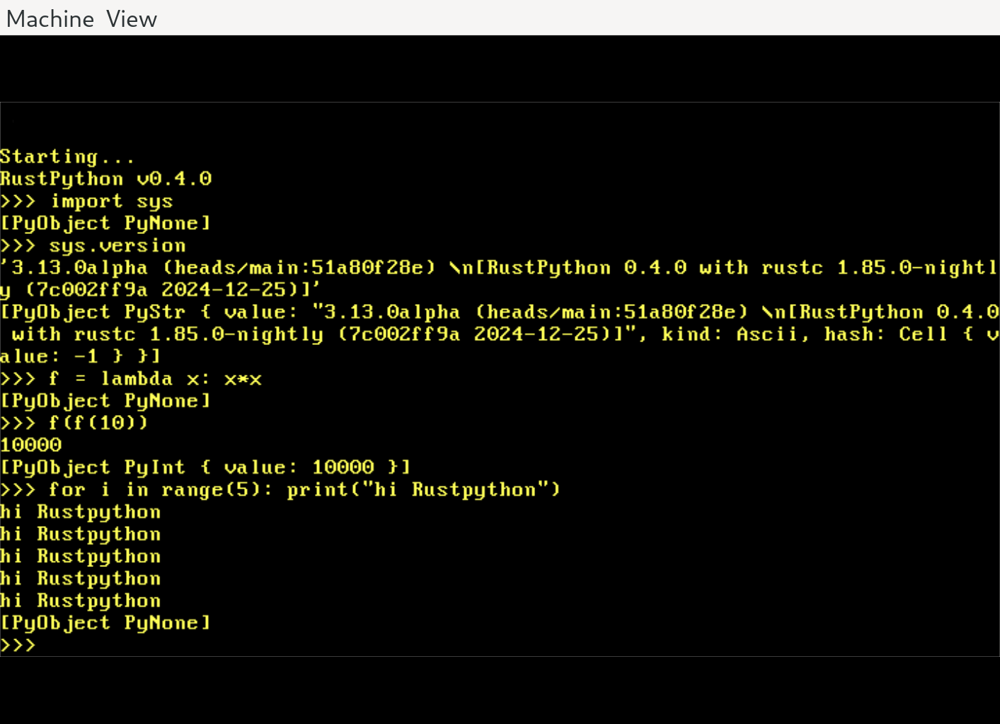

# egui OS

This is a proof-of-concept which demonstrates software rendering with the `euc` crate of immediate mode gui `egui` on bare silicon.

It makes use of the PS/2 and VGA subsystems. It is single threaded, single process only.

## This project is work in progress!
VGA output is grayscale. Input is extremely limited. It is very slow

## Building
(See BUILDING.md)
